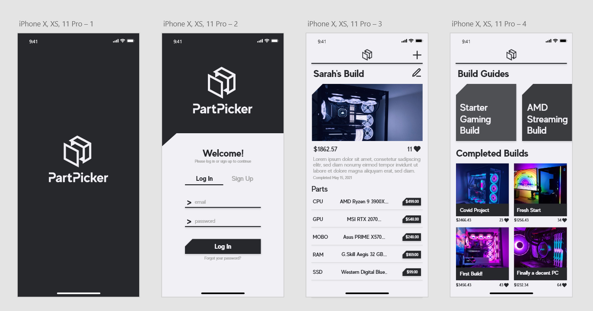
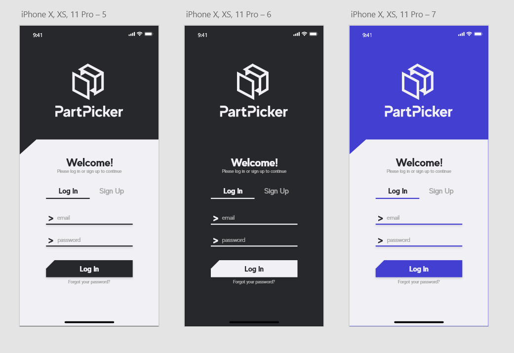
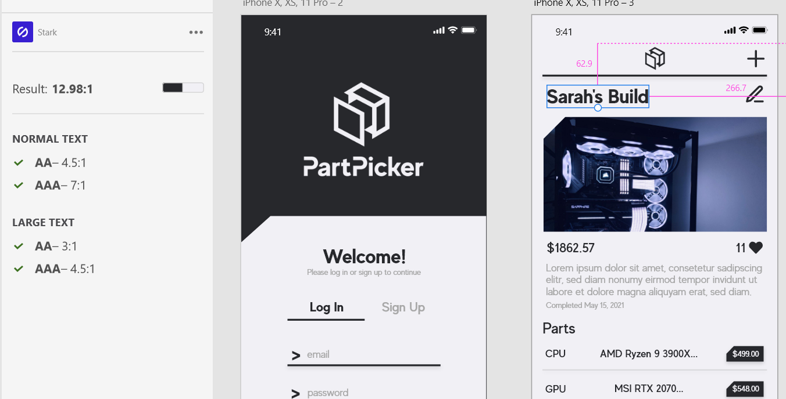
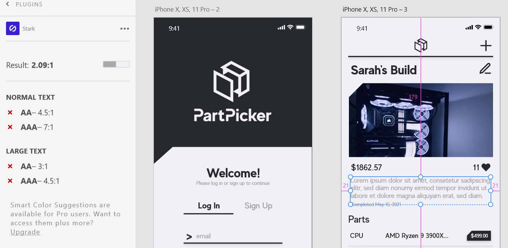
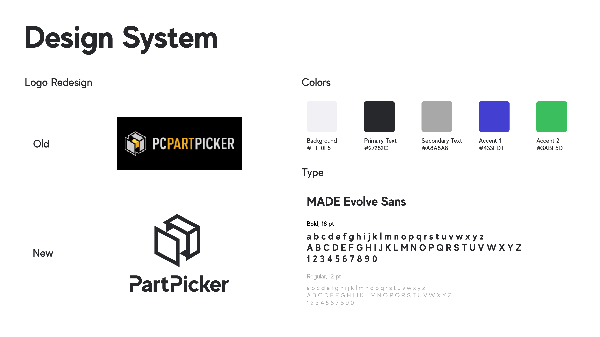

# Assignment06: Interface Design
### DH110, Joie Cao

## Intro
For my project, I intend to redesign and rebrand PCPartPicker's site, making it more modern, user friendly, and accessible for first time PC builders. Rather than redesign the website, I have redesigned its core features into an app. This app allows users to plan their builds, learn by watching tutorials and studying premade builds, and share their own builds on a social platform. My app intends to further promote the social aspect.

My 4 high fidelity interfaces include the following:
1. A loading screen for when the app is launched 
2. A log in/sign up screen, also a first impression for most users 
3. A PC building screen where users can add parts to their build
4. A social media-like build sharing screen that also includes premade build guides

## Screen Design

### 4 high fidelity interfaces 

### Color variations
Original, dark mode, and hue variation 

## Impression Test
For my impression test, I asked my friend who is a UX research student for his thoughts. He said the following:

"The first thing that stands out to me is how well-organized the text is. Everything is intuitive to find, and it's very easy to know where I should click if I want to perform a certain task. The use of both font size and font colors to distinguish text is also very well-implemented.
Aside from that, the clean choice of colors match the overall theme of the app very well, making good use of monochrome without coming off as dull.

One small usability issue that stands out is that it seems like the "Forgot your password?" button on the sign-in screen is a little too close to the "Log In" button, which could be hard to tap accurately for some users. Moving it down a little could fix that issue.

On the parts listing on the third screen, it seems a bit strange that the names of the parts are aligned in the center rather than the left when the titles are all getting cut off anyway, plus the fact that the labels for the part categories (CPU, GPU, etc.) are all left-aligned as well.

Overall, I appreciate how consistent and intuitive the design is, not hiding any functionalities in places that are hard to discover."

After hearing what he had to say, I felt more confident in the design theme that I had chosen with the app going forward. His note about the usability issue on the login screen seemed valid, especially considering his own experience with UX research, and wasn't too difficult of a fix. Overall, getting a fresh pair of eyes on my design and hearing his honest feedback was super valuable in bringing my design closer to a finished product.

## Accessibility Check

My primary text color passes the test

My secondary text color did not, for future iterations I will make this text darker

## Design System

### Logo Redesign
For the logo redesign, I wanted to create something simple and modern while also respecting the original design. The old design is actually very intuitive, it is a PC case being taken apart. For my redesign, I wanted to focus on creating a memorable silhouette. Additionally, I wanted this logo to easily fit color changes and different background colors. The current logo's complexity makes it difficult to match with different color schemes.

The new logo makes use of negative space to replace the gold block on the old logo. I also removed a part of the P in PartPicker to match. Finally, I removed "PC" from the brand name as it is a bit redundant and makes the name unnecessarily long. 

### Typography
My font is MADE Evolve Sans, a clean san serif with Bold, Medium, Regular, and Light versions. The font is easy on the eyes and very versatile. The Bold is great for titles while the Regular is perfect for paragraph text. Title fonts in my app are 30pt and paragraph is 16pt. Smaller detailed text such as prices for parts ar 12pt. 

### Colors
I wanted to keep the colors very simple and almost monochrome. Black gives the impression of luxury and quality, which is what I want my users to feel when using the app and assembling their PC. A bright blue was chosen as an accent color, but I have yet to find subtle ways to work it into the UI design. The bright green was chosen as the "Compatibility" color. In future screens, I will use this color to show that all the parts are compatible together. 

### Layout 
The layout of this app is designed for vertical scrolling. The spacing between most text and images is 15 pixels. 

### Other Notes
On the log in screen, I decided to use ">" as they represent the start of a line in the console. The portion of the PC building screen where all the parts are listed vertically was inspired by Robinhood app's vertical stock listings. 
